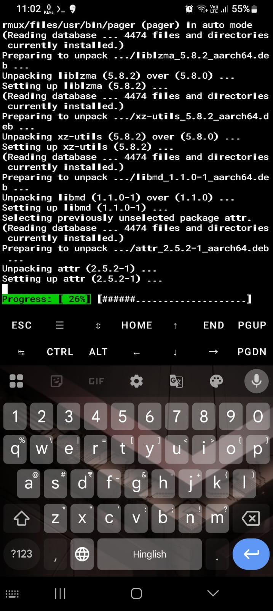
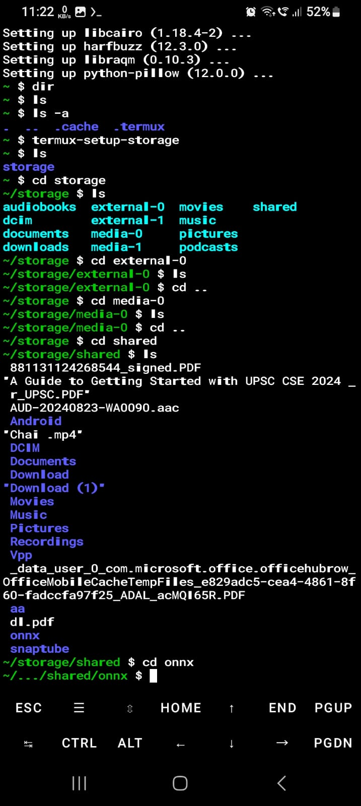
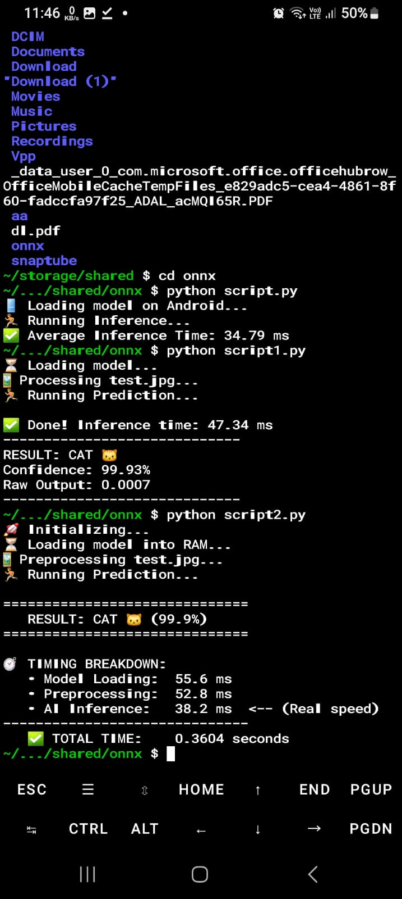
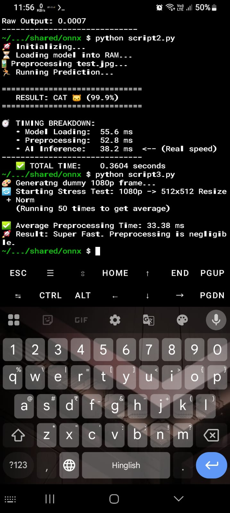

# 📱 Android Termux Setup Guide

Follow these steps to set up on-device benchmarking using Termux on Android.

---

## 🚀 Installation Steps

### Step 1: Install Termux

Install Termux from **F-Droid** (not Google Play Store, as the Play Store version is outdated).

> **⚠️ Important:** Download from [F-Droid](https://f-droid.org/packages/com.termux/) to get the latest maintained version.

---

### Step 2: Set Up Environment

Open Termux and run the following commands:
```bash
# Update package lists
pkg update && pkg upgrade

# Install Python and build tools
pkg install python cmake clang libjpeg-turbo build-essential

# Install ONNX Runtime (This might take time to compile)
pkg install python-numpy python-onnxruntime

# Grant Storage Permission
termux-setup-storage
```

> **💡 Note:** The ONNX Runtime installation may take several minutes to compile. Be patient!

---

### Step 3: Prepare Your Project

Create a folder named `onnx` containing:
- Your Python script (choose from options below)
- Your ONNX model file

---

## 📝 Available Scripts

Choose the script that best fits your use case:

| Script | Purpose | Use Case |
|--------|---------|----------|
| `script.py` | Runs on randomly generated image | Quick sanity check without real images |
| `script1.py` | Runs on actual image file | Real-world inference testing |
| `script2.py` | Same as above + extended metrics | Detailed performance analysis |
| `script3.py` | Video preprocessing simulation | Replicates video frame processing (hackathon-specific) |

> **📌 Recommended Workflow:**  
> Start by testing with the `dog_vs_cat_mobile.onnx` example file using `script.py`, then modify the scripts according to your specific needs.

**For `script1.py` and `script2.py`:**
- Copy an image file to the `onnx` folder
- Rename it to `test.jpg`

---

## 📸 Setup Screenshots

Below are visual guides showing the setup process:


*Installing packages from Termux*

---


*Traversing into the onnx folder using Android terminal*

---


*Results for script2.py*

---


*Results for script3.py*

---

## 🔧 Troubleshooting

**Issue:** Permission denied errors  
**Solution:** Make sure you ran `termux-setup-storage` and granted storage permissions

**Issue:** ONNX Runtime installation fails  
**Solution:** Ensure you have enough storage space (at least 500MB free) and a stable internet connection

**Issue:** Script can't find the model  
**Solution:** Verify that both the script and `.onnx` file are in the same `onnx` folder

---

## ✅ Next Steps

Once setup is complete:
1. Navigate to your `onnx` folder: `cd storage/shared/onnx`
2. Run your chosen script: `python script.py`
3. Analyze the performance metrics
4. Iterate on your model if needed

---
